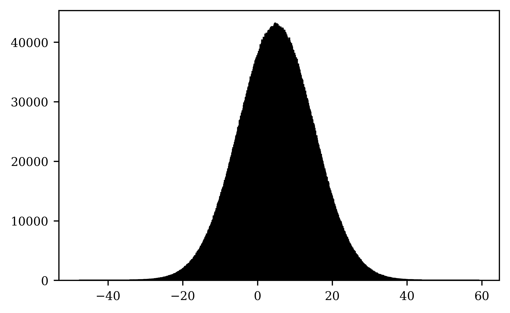

# Nice random variate generator

Class to sample random variables from various probability distributions, including:

* Discrete distributions:
    + **Bernoulli**, with parameter for the probability *p*.
    + **Binomial**, with parameters for the probability *p* and number of trials *n*.
    + **Geometric**, with parameter for the probability *p*.
    + **Poisson**, with parameter $\lambda$ for the number of times an event is expected to happen per time interval
* Continuous distributions:
    + **Uniform**, with parameters for defining the range (*a*, *b*).
    + **Normal** or **Gaussian**, with parameters for the mean $\mu$ and standard deviation $\sigma$.
    + **Exponential**, with parameter $\lambda$ for the interarrival time.
    + **Weibull**, with scale $\lambda$ and shape $\alpha$ parameters.

## User guide

The library is quite simple and only consists of two modules:

* ```rv_generator.py```: It is the script containing the definition of the random variate generator class. Within it, functions have been defined in order to generate samples from the different distributions available. As this is a class definition, it is not an executable.

* ```examples.py```: It is an example executable script showing how the ```RVGenerator``` class can be employed.

In order to use this library, just make sure that all the required packages for execution are installed in your Python working environment. For that purpose, you can use the following command to installed the required packages:

```bash
pip install > requirements.txt
```

Once this is done, you have all you need in order to use the random variate generator. Just remember to load within your executable the required class as follows:

```python
from rv_generator import RVGenerator
rvg = RVGenerator()
```

### Use details

Within the ```examples.py``` executable, you will see that it is possible to change two main execution parameters:

* **Seed**: A seed can be provided to the class for replicability. If no value is provided, a default value will be calculated based on the current time. It can be done in three different ways:
    1. As an argument when loading the class. This will use the provided seed for all further function calls.
        ```python
        from rv_generator import RVGenerator
        rvg = RVGenerator(seed=123)
        ```
    2. Calling the set_seed() function after loading the class. This will use the provided seed for all further function calls.
        ```python
        from rv_generator import RVGenerator
        rvg = RVGenerator()
        rvg.set_seed(seed=123)
        ```
    3. Providing the seed individually to the functions generating samples from different probability distributions. This will use the provided seed only for that function call.
        ```python
        from rv_generator import RVGenerator
        rvg = RVGenerator()
        sample = rvg.exponential(seed=123)
        ```
* **Output size**: Any natural number can be provided to change the number of random variables to be sampled from each distribution. This has to be provided individually to each function with the ```size``` argument. Default value is 1.
    ```python
        from rv_generator import RVGenerator
        rvg = RVGenerator(seed=123)
        rvg.exponential(size=50)
    ```

## Examples

* **Normal or gaussian distribution**
```python
    from rv_generator import RVGenerator
    
    rvg = RVGenerator(seed=12345)
    samples = rvg.gaussian(mu=5, sigma=10, size=10000000)

    figure = TheArtist(latex=False, n_rows = 1, n_cols = 1)
    figure.plot_hist(samples, 1000, 0, 0, color='black', edgecolor='black')
```



* **Weibull distribution**

```python
    from rv_generator import RVGenerator
    
    rvg = RVGenerator(seed=12345)
    samples = rvg.weibull(lambda_=1, alpha_=2, size=10000000)

    figure = TheArtist(latex=False, n_rows = 1, n_cols = 1)
    figure.plot_hist(samples, 1000, 0, 0, color='black', edgecolor='black')
```


